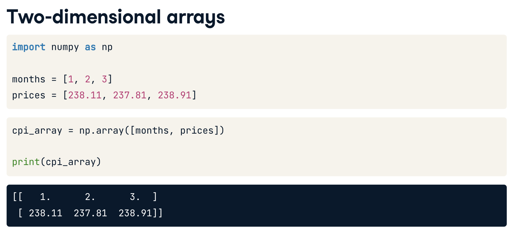
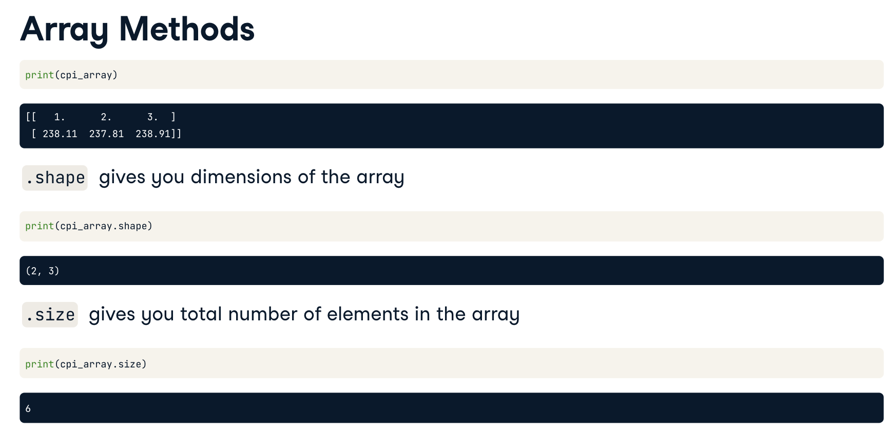
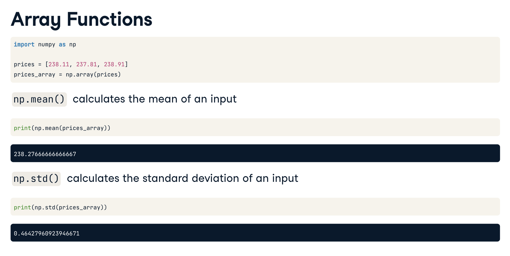
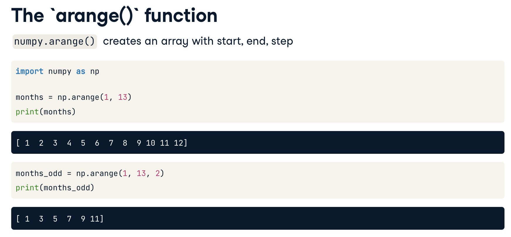
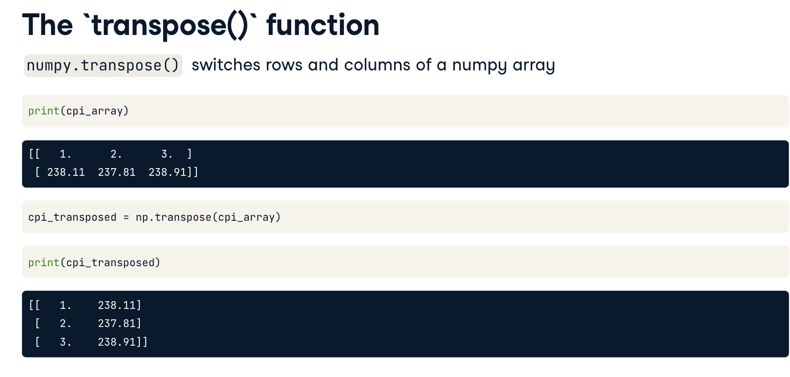
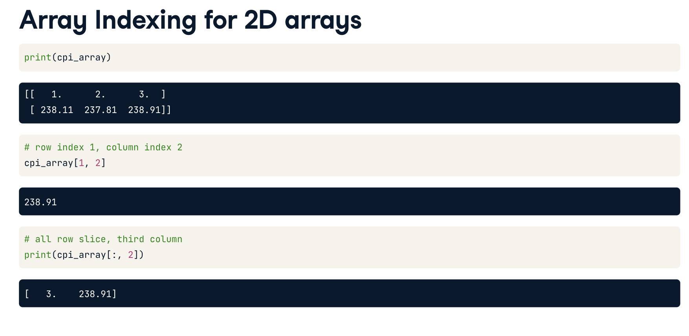
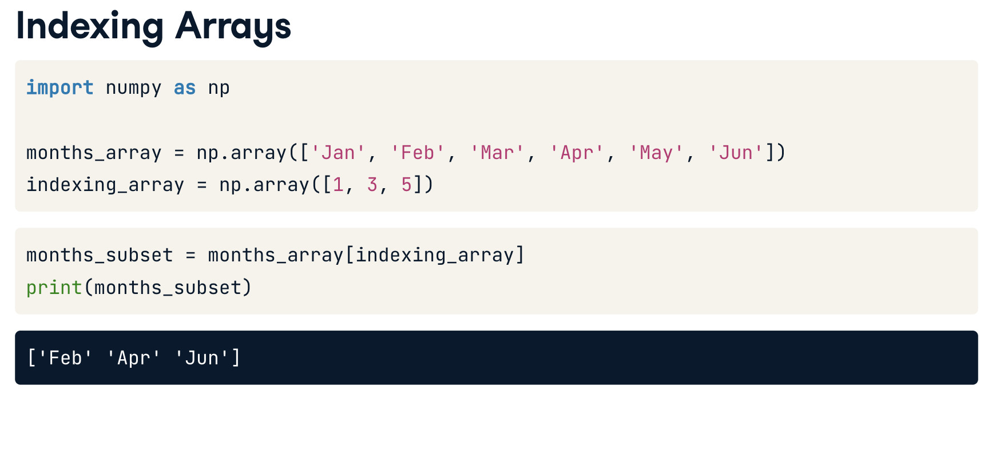
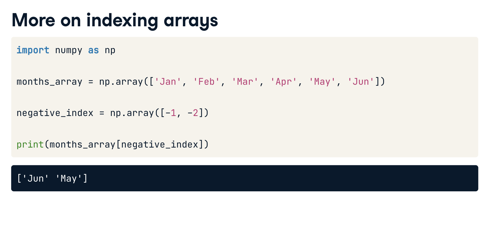
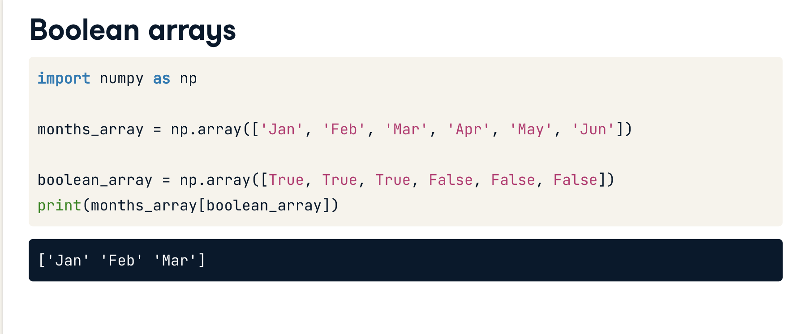
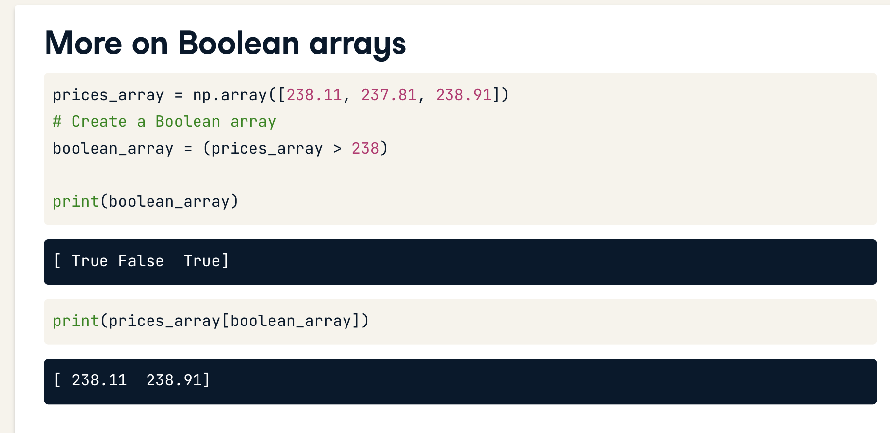

# [Introduction to Python for Finance](https://app.datacamp.com/learn/courses/introduction-to-python-for-finance)


## 1 Welcome to Python

This chapter is an introduction to basics in Python, including how to name variables and various data types in Python.

### Welcome to Python for Finance!

### Why might you use Python in finance?

### Run code vs. submit answer

### Comments and variables

### Printing output

### Finding the average revenue

### Data types

### Creating variables

### Determining types

### Booleans in Python

### Combining data types


## 2 Lists


### This chapter introduces lists in Python and how they can be used to work with data.

### Lists

### Creating lists in Python

### Indexing list items

### Slicing multiple list elements

### Nested lists

### Stock up a nested list

### Subset a nested list

### List methods and functions

### Exploring list methods and functions

- Sort this list
```python
# Print the sorted list prices
prices = [159.54, 37.13, 71.17]
prices.sort()
print(prices)
```

- find max price of list
```python
# Find the maximum price in the list price
prices = [159.54, 37.13, 71.17]
price_max = max(prices)
print(price_max)
```

### Using list methods to add data

```python
# Append a name to the list names
names.append('Amazon.com')
print(names)

# Extend list names
more_elements = ['DowDuPont', 'Alphabet Inc']
names.extend(more_elements)
print(names)
```

### Finding stock with maximum price
- using index of list to find max price

```python
# Do not modify this
max_price = max(prices)

# Identify index of max price
max_index = prices.index(max_price)

# Identify the name of the company with max price
max_stock_name = names[max_index]

# Fill in the blanks
print('The largest stock price is associated with ' + max_stock_name + ' and is $' + str(max_price) + '.')
```

## 3 Arrays in Python
- create arrays using the np.array() function

### [Create an array](https://campus.datacamp.com/courses/introduction-to-python-for-finance/arrays-in-python?ex=2)
```python
# Import numpy as np
import numpy as np

# Lists
prices = [170.12, 93.29, 55.28, 145.30, 171.81, 59.50, 100.50]
earnings = [9.2, 5.31, 2.41, 5.91, 15.42, 2.51, 6.79]

# NumPy arrays
prices_array = np.array(prices)
earnings_array = np.array(earnings)

# Print the arrays
print(prices_array)
print(earnings_array)
```

### [Elementwise operations on arrays](https://campus.datacamp.com/courses/introduction-to-python-for-finance/arrays-in-python?ex=3)
```python
# Import numpy as np
import numpy as np

# Create PE ratio array
pe_array = prices_array/earnings_array

# Print pe_array
print(pe_array)
```

### [Subsetting elements from an array](https://campus.datacamp.com/courses/introduction-to-python-for-finance/arrays-in-python?ex=4)

```python
# Subset the first three elements
prices_subset_1 = prices_array[0:3]
print(prices_subset_1)
```
```python
# Subset last three elements
prices_subset_2 = prices_array[-3:]
print(prices_subset_2)
```
```python
# Subset every third element
prices_subset_3 = prices_array[0:7:3]
print(prices_subset_3)
```

### [2D arrays and functions](https://campus.datacamp.com/courses/introduction-to-python-for-finance/arrays-in-python?ex=5)









### Creating a 2D array

```python
# Create a 2D array of prices and earnings
stock_array = np.array([prices,earnings])
print(stock_array)

# Print the shape of stock_array
print(stock_array.shape)

# Print the size of stock_array
print(stock_array.size)
```
```python
# Transpose stock_array
stock_array_transposed = np.transpose(stock_array)
print(stock_array_transposed)

# Print the shape of stock_array
print(stock_array_transposed.shape)

# Print the size of stock_array
print(stock_array_transposed.size)
```

### [Subsetting 2D arrays](https://campus.datacamp.com/courses/introduction-to-python-for-finance/arrays-in-python?ex=7)

```python
# Subset prices from stock_array_transposed
prices = stock_array_transposed[:, 0]
print(prices)
```

```python
# Subset earnings from stock_array_transposed
earnings = stock_array_transposed[:,1]
print(earnings)
```

```python
# Subset the price and earning for first company
company_1 = stock_array_transposed[0,:]
print(company_1)
```

### [Calculating array stats](https://campus.datacamp.com/courses/introduction-to-python-for-finance/arrays-in-python?ex=8)

```python
# Calculate the mean
prices_mean = np.mean(prices)
print(prices_mean)
```

```python
# Calculate the standard deviation
prices_std = np.std(prices)
print(prices_std)
```

### Generating a sequence of numbers

```python
# Create and print company_ids
company_ids = np.arange(1, 8, 1)
print(company_ids)

# Create and print company_ids_odd
company_ids_odd = np.arange(1, 8, 2)
print(company_ids_odd)
```

### Using arrays for analysis







### Who's above average?

### Who's in health care?


## 4 Visualization in Python


### In this chapter, you will be introduced to the Matplotlib package for creating line plots, scatter plots, and histograms.

### Visualization in Python

### Importing matplotlib and pyplot

### Adding axis labels and titles

### Multiple lines on the same plot

### Scatterplots

### Histograms

### What are applications of histograms in finance?

### Is data normally distributed?

### Comparing two histograms

### Adding a legend


## 5 S&P 100 Case Study


### In this chapter, you will get a chance to apply all the techniques you learned in the course on the S&P 100 data.

### Introducing the dataset

### Lists

### Arrays and NumPy

### A closer look at the sectors

### Filtering arrays

### Summarizing sector data

### Plot P/E ratios

### Visualizing trends

### Histogram of P/E ratios

### Identify the outlier

### Name the outlier

