# 1 Datetimes and Dictionaries


## Representing time with datetimes

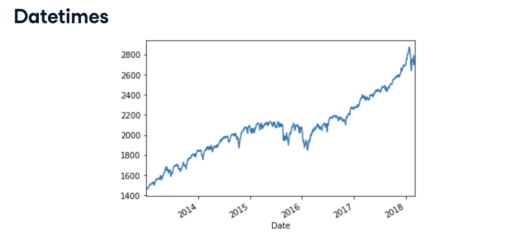
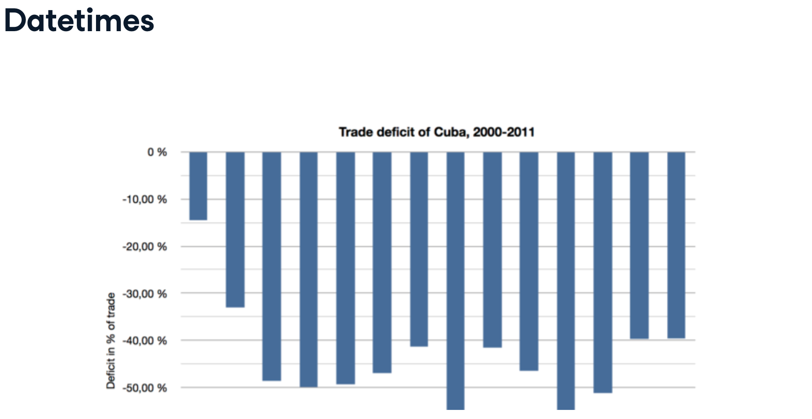
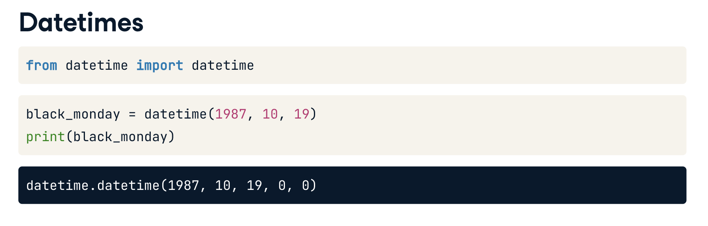
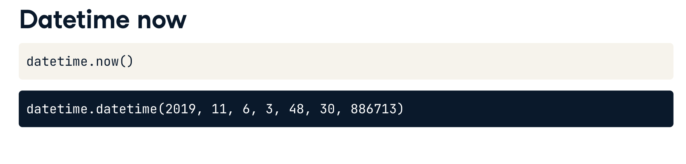
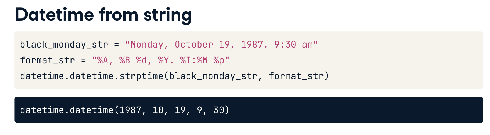
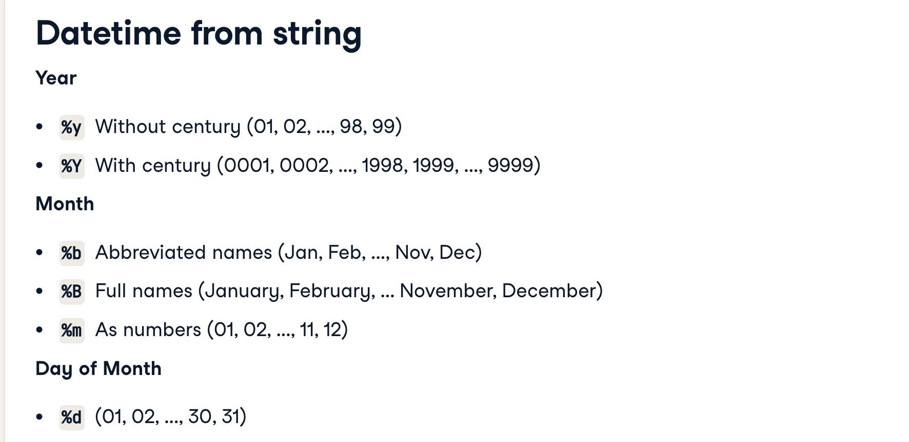
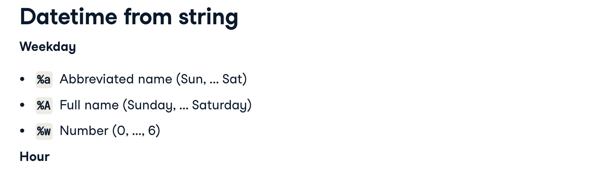
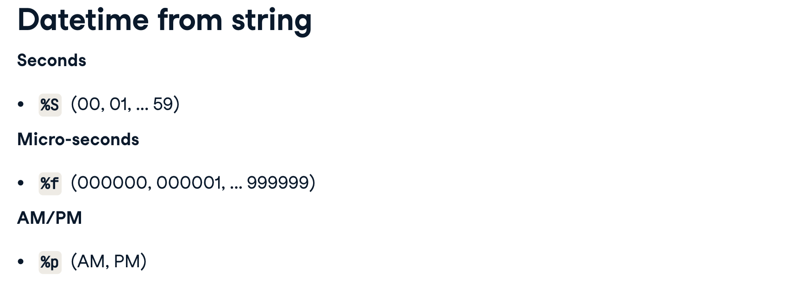
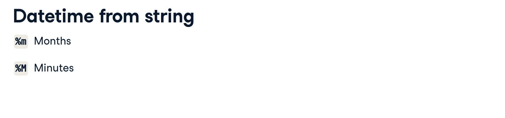
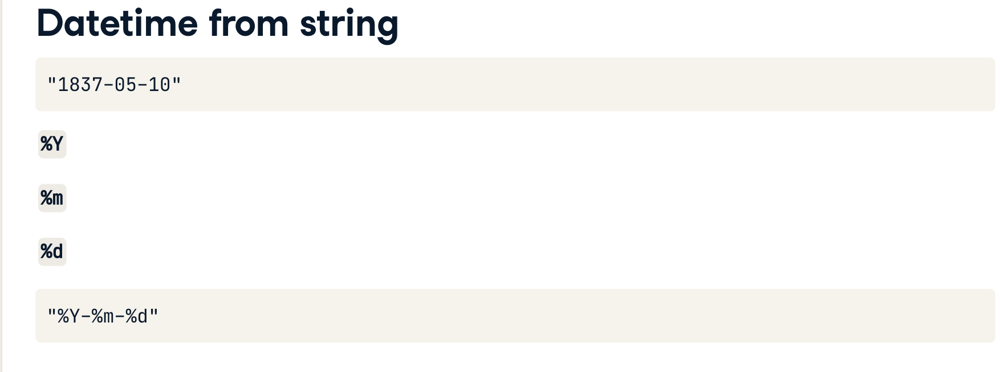
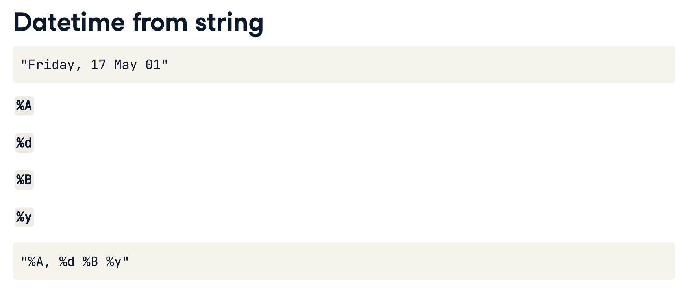
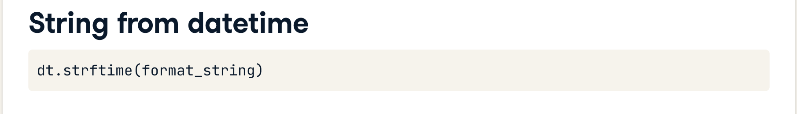
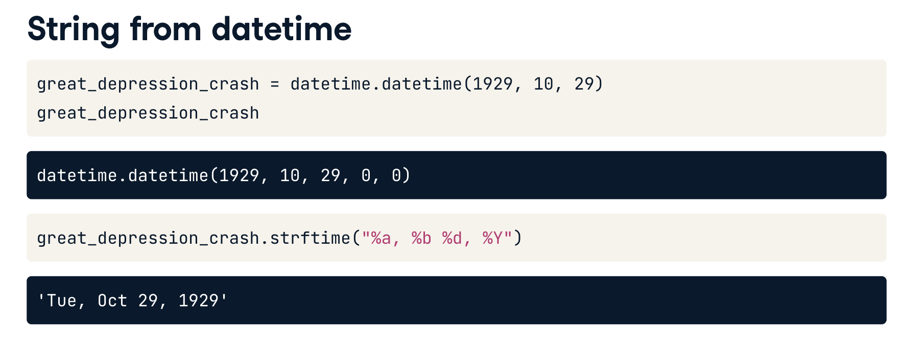


## Creating datetimes for dates
```python
import datetime

# Date and time now
now = datetime.datetime.now()
print(now)

# Flash crash May 28, 1962
flash_crash = datetime.datetime(1962, 5, 28)
print(flash_crash)

# Black Monday Oct 19, 1987
black_monday = datetime.datetime(1987, 10, 19)
print(black_monday)
```

## [Datetimes from strings](https://campus.datacamp.com/courses/intermediate-python-for-finance/datetimes-and-dictionaries?ex=3)

## Converting format with datetimes

## Working with datetimes

## Accessing datetime attributes

## Comparing datetimes

## Making relative datetimes

## Dictionaries

## Creating and accessing dictionaries

## Accessing safely and deleting


# 2 Control Flow and Logic


## Through hands-on activities, you’ll discover how to use Boolean logic to determine truth and use comparison and equality operators to control execution in if-statements and loops.

## Comparison operators

## Equality across types

## Assignment and equality

## Comparing dividends

## Boolean operators

## Decisions with Boolean operations

## Assigning variables with Boolean operators

## Negating with Boolean operators

## If statements

## Control statements

## Comparing sales and purchases

## Branching with elif and else

## For and while loops

## Breaking out of a for loop

## Controlling loop execution


# 3 Pandas Dataframe


## Creating a DataFrame

## Creating DataFrames

## Reading market history

## Accessing Data

## Accessing using names

## Accessing using indexes

## Aggregating and summarizing

## Mean prices

## Median prices

## Extending and manipulating data

## Creating new columns

## Dropping columns from DataFrame

## Manipulating data with Pandas


# 4 Working with NASDAQ Stock Data


## In this final chapter, you’ll try your hand at working with real-world NASDAQ stock data as you learn how to interpret new data, create masks to filter data, and visualize your findings with plots.

## Peeking at data with head, tail, and describe

## Why use describe

## Peek at top and bottom

## Describing data

## Filtering data

## Why filter data

## Filtering stock data.

## Selecting data from data range

## Plotting data

## Identifying plot type

## Making a line plot

## Choose kind of plot

## Wrapping up

